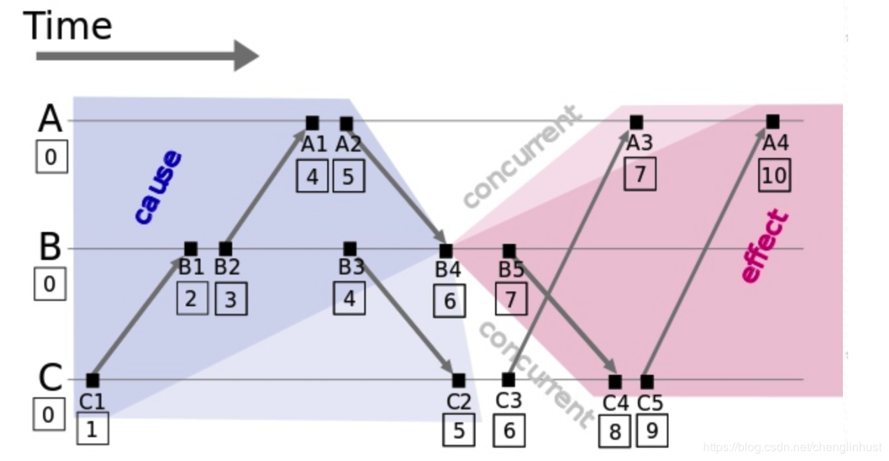
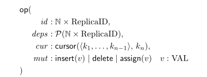
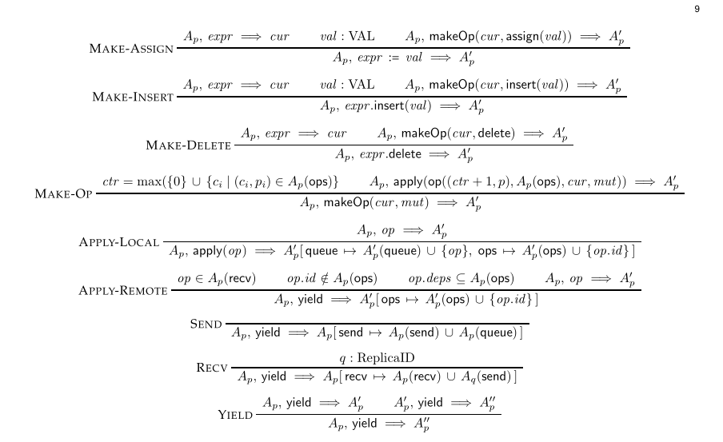
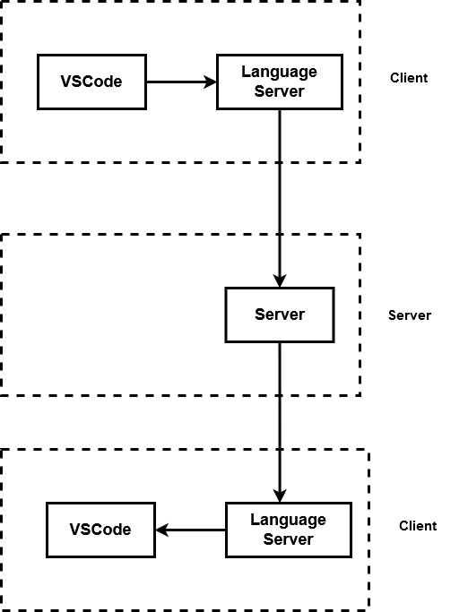
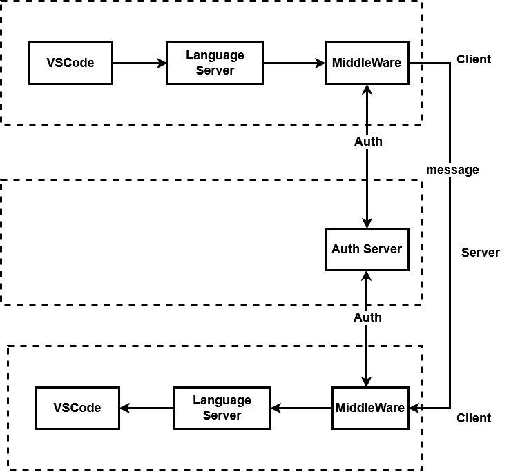
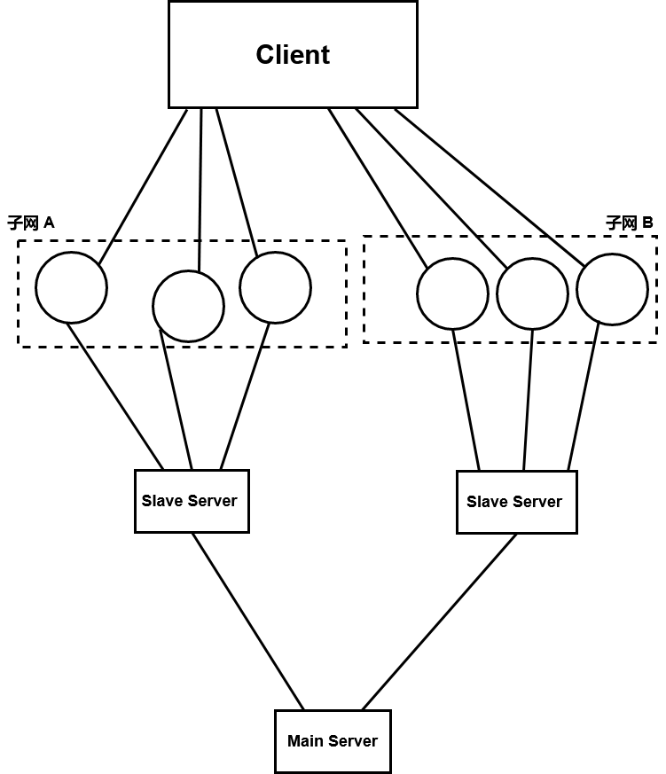
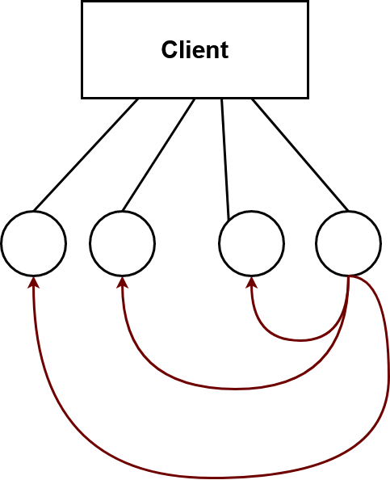

# <span id="head1"> 结题报告</span>

[ 结题报告](#head1)

- [ 项目简介](#head2)
  - [ TypeScript](#head3)
  - [ CRDT](#head4)
  - [Language Server](#head5)
  - [ 服务端](#head6)
- [ 设计思路](#head7)
  - [ 预期效果](#head8)
  - [ Automerge](#head9)
    - [CRDT 实现](#head10)
    - [Lamport 时间戳](#head11)
    - [ 操作结构](#head12)
    - [ 原子命令](#head13)
    - [ 特点与优势](#head14)
  - [VSCode API](#head15)
- [ 客户端](#head16)
  - [ 技术路线](#head17)
  - [ 解决工作区变化循环响应](#head18)
  - [ 登录登出机制](#head19)
  - [ 光标](#head20)
  - [undo 与 redo](#head21)
- [ 服务端](#head22)
  - [中心化的 colive-server](#head23)
  - [分布式的 colive-distributed-middleware](#head24)
  - [ 可行的改进](#head25)
  - [ 中心化的区域子服务器](#head26)
  - [ 客户端作中继](#head27)
- [ 展望](#head28)
- [ 致谢](#head29)
- [ 参考资料](#head30)

## <span id="head2"> 项目简介</span>

使用 TypeScript 实现基于 CRDT 的 LaTeX 实时协作编辑系统，编写成符合 LSP 协议的插件，并使之能在 VSCode 等 IDE 上使用。

### <span id="head3"> TypeScript</span>

JavaScript 的超集，主要区别是提供了静态类型注解，解决了 JavaScript 动态类型带来的问题。 VSCode 的原生代码中 TypeScript 所占比重较大，故微软官方建议 VSCode 插件开发时使用 TypeScript 。

### <span id="head4"> CRDT</span>

无冲突可复制数据类型，用于解决在分布式系统中并发修改造成的各个客户端结果不一致的问题。由于实现功能完备的 CRDT 工作量过大，而且在 2018 年的大作业中已经有实现了，我们决定使用成熟的 CRDT 库 Automerge 。

### <span id="head5">Language Server</span>

微软提出的一种 IDE 插件开发机制。将插件对文本的操作从插件本身分离出来，放到一个独立的 Language Server 进程里，用于实现跨 IDE 的插件开发。

### <span id="head6"> 服务端</span>

本项目服务端使用 flask-socketIO 进行文本内容的传输。为了适应分布式协调的需要，本项目对服务端进行了改进与创新：当客户端不处于同一个子网时，以一台阿里云服务器作为中心节点进行广播；当客户端处于同一子网时，通过中间件直接在客户端之间广播。

## <span id="head7"> 设计思路</span>

### <span id="head8"> 预期效果</span>

我们预期在 2018 年 OSH 大作业的基础上实现如下改进：

- 项目平台从文本格式、编辑效果单一的网页端代码编辑器 CodeMirror 更换为功能强大，可以和其他插件协调配合的文本编辑器 VSCode 。
- 丰富原有的 CRDT 实现，从而能够支持剪切、粘贴、撤销和重做等操作。
- 改进用户的登录登出方式，使用户能够自由地选择开始协作的时机。
- 将广播方式从中心化的服务端广播改为根据网络情况选择是否不通过服务器在客户端之间直接进行广播，提高了项目的并发性。

### <span id="head9"> Automerge</span>

充分调研 CRDT 数据结构后，我们发现其实现难度远超我们现在的能力水平，而且自己实现的 CRDT 效果不一定很好，所以我们决定直接使用 GitHub 上的开源 CRDT 库 Automerge 。


#### <span id="head10">CRDT 实现</span>

传统的协作编辑应用程序基于运算变换（OT）的算法，大多数部署 OT 协作系统，包括谷歌文档、Novell Vibe 和 apachewave 依赖于单个服务器来决定操作的总顺序，这是一个继承自 Jupiter 系统的设计决策。这种方法的优点是使转换函数更简单、更不容易出错，但 automerge 实现的是支持对等协作而不需要单一的服务器。

为了定义协作可编辑数据结构的语义， automerge 定义了一个简单的命令语言，该命令语言在任何本地副本上执行，用于查询和修改该副本。查询没有副作用，但是修改文档可以产生描述变化的操作。这些操作将立即应用于文档的本地副本，并排队等待异步广播到其他副本。它不是一种完整的编程语言，而是一种 API ，通过它可以查询和修改文档状态。

#### <span id="head11">Lamport 时间戳</span>

模型中的每个操作都被赋予一个唯一的标识符，该标识符 id 用于本地状态和游标中。为了在不需要副本之间同步协调的情况下生成全局唯一的操作标识符，我们使用 Lamport 时间戳。 Lamport 时间戳是一对 (c, p) ，其中 p 是进行编辑的副本的唯一标识符（例如，其公钥的散列），c  是一个计数器，它存储在每个副本上，并为每个操作递增。由于每个副本都生成一个严格单调递增的计数器值序列 c ，所以对 (c, p) 是唯一的。如果副本接收到计数器值 c 大于本地存储的计数器值的操作，则本地计数器将增加到传入计数器的值。这确保了如果操作 O1 是在 O2 之前发生的（也就是说，生成 O2 的副本在 O2 生成之前已经接收并处理了 O1 ），那么 O2 的计数器值必须大于 O1 。只有并发操作才能具有相等的计数器值。



- 每个事件对应一个 Lamport 时间戳，初始值为 0 ；

- 如果事件在节点内发生，本地进程中的时间戳加 1 ；

- 如果事件属于发送事件，本地进程中的时间戳加 1 并在消息中带上该时间戳；

- 如果事件属于接收事件，本地进程中的时间戳 = Max(本地时间戳，消息中的时间戳) + 1。

#### <span id="head12"> 操作结构</span>



其中 id 是唯一标识操作的 Lamport 时间戳， cur 是描述被修改文档中位置的游标， mut 是在指定位置请求的变异。deps 是操作的因果依赖集，以 Lamport 时间戳集的形式给出。下面的规则将 deps 定义为在生成操作时已应用于文档的所有操作 id 的集合。在一个实际的实现中，这个集合将变得不切实际的大，因此将使用因果历史的紧凑表示。然而，为了避免语义上的歧义，我们将依赖项作为一组简单的操作 id 。因果依赖 deps 的目的是对操作施加偏序：一个操作只能在“之前发生”的所有操作之后应用。这意味着在一个特定副本上生成的操作序列将以相同的顺序应用于其他副本。

#### <span id="head13"> 原子命令</span>



MAKE-ASSIGN、MAKE-INSERT  和  MAKE-DELETE  规则定义了这些命令如何改变文档：这三个命令都委托给  MAKE-OP  来生成和应用操作。 MAKE-OP  通过选择一个比  Ap(ops)  中任何现有计数器大 1 的计数器值来生成一个新的 Lamport 时间戳，所有应用于副本 p 的操作 id 的集合。 make-op  构造一个如上所述形式的 op()  元组，并委托  APPLY-LOCAL  规则来处理该操作。 APPLY-LOCAL  做三件事：计算操作以生成修改后的本地状态  A′p  ，将操作添加到生成的操作 Ap(queue) 的队列中，并将操作ID添加到已处理的操作 Ap(ops) 集合中。执行网络通信：向其他副本发送和接收操作，以及从远程副本应用操作。规则 APPLY-REMOTE 、 SEND 、 RECV 和 YIELD 定义了 yield 的语义。 SEND 规则接受 APPLY-LOCAL 放入 p(queue) 中的任何操作，并将它们添加到发送缓冲区 Ap(send) 。相应地， recv 规则在副本 q 的发送缓冲区中获取操作，并将它们添加到副本 p 的接收缓冲区 Ap(recv) 。这是唯一涉及多个副本的规则，它为所有网络通信建模。一旦一个操作出现在接收缓冲区 Ap(recv) 中，就可以应用 APPLY-REMOTE 规则。在操作尚未处理且因果关系满足的前提下， APPLY-REMOTE 用 APPLY-LOCAL 相同的方式应用操作，并将操作ID添加到已处理的操作集合 Ap(ops) 中，实际的文档修改是通过应用这些操作来执行的。

#### <span id="head14"> 特点与优势</span>

- 易于上手

由于 Automerge 是对字符串等原生的 Javascript 数据结构的分布式一致化，而且它的接口与 git 类似，所以我们可以很快上手 Automerge 的接口。

- 与网络隔离

Automerge 的实现与网络无关，可以很好适配 socketIO ，也便于我们对服务端进行优化。

- 功能丰富

虽然 Automerge 的 undo 和 redo 的行为与我们的预期不符，不过 Automerge 记录了操作历史，所以我们可以自己改写它的 undo 和 redo 方法。

### <span id="head15">VSCode API</span>

VSCode 提供了一些 API 来帮助插件获取工作区的文本变化，修改工作区的文本内容，以及进行插件本身和语言服务器之间的通信。

``` typescript
// extension.ts
vscode.workspace.onDidChangeTextDocument(changeEvent => {
	// get workspace changes
};
client.sendRequest('data', [operateList]);
//send message from extension to language server
```

```typescript
// server.ts
connection.workspace.applyEdit(wse);
connection.onRequest('data', (changeQueue: ChangeIncident[]) => {
//get message from extension
});
```

## <span id="head16"> 客户端</span>

### <span id="head17"> 技术路线</span>

- 分析工作区文本修改

我们将用户对工作区文本的修改分为插入，删除，替换，撤销和重做五种类型。

```typescript
//extension.ts
interface ChangeIncident {
/*
* The operation of user: insert, delete, replace, redo, undo
* When multi-cursors are used, we consider them as different operation
*/
	operateType: string;
	text: string;
	from: { line: number, ch: number };
	to: { line: number, ch: number };
	rangeOffset: number;
	rangeLength: number;
}
```

在 extension.ts 中，当工作区文本发生变化时，会触发 onDidChangeTextDocument ，在其回调中我们将用户对 VSCode 工作区文本的操作转化为我们的数据结构 ChangeIncident ，并将其发送给 language server 。

- 更新本地副本并广播变化

当 language server 收到来自插件的变化时，根据变化更新 Automerge.doc 并将副本变化广播到其他客户端。

- 接收来自其他客户端的变化

当 language server 收到来自其他客户端副本的变化时，更新本地的 Automerge.doc 。 Automerge 的实现保证了所有客户端副本的最终结果一致，且与修改被应用的顺序无关。

- 渲染 VSCode 工作区

本地的 doc 更新完成后，写回 VSCode 的工作区。

### <span id="head18"> 解决工作区变化循环响应</span>

在 vscode 官方文档的 Custom Editor API 部分有这么一段：

>It's important to remember that any file edits that a custom editor triggers will cause `onDidChangeTextDocument` to fire. Make sure your extension does not get into an update loop  where the user makes an edit in the webview, which fires  onDidChangeTextDocument, which causes the webview to update, which  causes the webview to trigger another update on your extension, which  fires `onDidChangeTextDocument`, and so on.

VSCode 无法识别对工作区的修改来自用户还是插件本身，language server 的 applyEdit 也会触发 onDidChangeTextDocument ，这样会导致循环响应。

我们采用的方法是在 applyEdit 的同时设置标记位屏蔽 onDidChangeTextDocument 向 language server 发送的消息。但这样的话，渲染同时用户对工作区内容的编辑就会丢失。我们通过查阅多方资料，提出了一种不完善的解决方案：

如果 language server 和用户同时对工作区进行修改，会有一方的修改失效，而 language server 的修改失效可以通过 applyEdit 的回调参数判断。当上述情况出现时，我们重新处理上一次插件向 language 发送的修改消息（平凡情况下，该消息会被屏蔽），并在 language server 重新应用失效的 workSpaceEdit 。对于用户的修改被 language server 的修改冲掉的情况，我们暂时没有一个好的解决方案。此类情况会造成用户某一次特定的修改消失，但是不影响客户端之间文档的一致性。

```typescript
function applyEdit() {
	if (editFinished && wseQueue.length) {
		editFinished = false;
		connection.workspace.applyEdit(wseQueue[0]).then(response => {
			if (response.applied) {
				wseQueue.shift();
			}
			else {
				recvFromUser(lastChange);
			}
			editFinished = true;
			applyEdit();
			render();
		});
	}
}
```

### <span id="head19"> 登录登出机制</span>

- 18 年大作业中后登录的用户的工作区内容会被强制同步成前面用户的工作区内容，而我们采用的是在用户需要同步的时候通过 VSCode 左侧插件栏的按钮进行同步。
- 后登录的用户连接后，服务器会向第一个登录的用户 (admin) 发送同步请求，admin 收到请求后会将自己的 doc 发送到请求同步的用户处。
- 用户可以随时选择手动 disconnect ，disconnect 后用户的工作区将不再同步，他的光标也会在其他客户端消失，当所有用户登出时，服务器重新开始设置 userID 。
- disconnect 后， 用户的修改将不再同步。只有当用户重新连接的时候，再将第一个登录的用户的工作区内容重新发送给其他用户并覆盖它们的工作区。这样的机制有待进一步改进，可以在本地设置一个队列保存掉线的时候的修改，等到网络重新连接时再合并。
- socketIO 自带了长轮询机制，服务端每隔一段时间（可以在服务端设置）会向用户发送心跳包询问用户是否在线，如果没有应答则会触发 disconnect 。此机制解决了用户通过关掉 VSCode 窗口强制退出的问题。

### <span id="head20"> 光标</span>

- 18 年的大作业中没有显示各个用户的光标，我们通过 VSCode 的 API 获取了实时光标位置，通过自己绘制光标实现了实时同步各个用户的光标，不同用户的光标颜色不同。
- VSCode 支持多光标操作，我们的插件也支持多光标同步编辑。

### <span id="head21">undo 与 redo</span>

- Automerge 自带的 undo 是将本客户端的某次操作和上次操作之间的所有操作全部撤销，其中包括来自其他客户端的操作，我们认为这样对于其他客户端是不公平的。而我们理解的 undo 是使所有客户端同时回退到 doc 的上一个版本，这个版本不一定属于执行撤销操作的那个客户端。所以我们重写了它的 undo 方法。
- 对于 redo ，我们维护了一个 undo 栈，redo 就是回退到 undo 之前的版本并退栈。
- 当出现新的修改时，我们清空所有客户端的 undo 栈，此时无法执行重做。

## <span id="head22"> 服务端</span>

服务端总体使用 python 框架 flask ，其中消息内容传递的部分使用 flask-socketio 实现。

### <span id="head23">中心化的 colive-server</span>

- C/S 架构：VSCode Extension - LSP - server 。

- 分布式：文本协作的处理完成于客户端（LSP），不依赖 server 。

- 服务端功能：认证鉴权，消息广播。
- 优点：简单易实现、易维护，一致性好，便于追踪用户状态。
- 缺点：单服务器有并发的性能瓶颈，客户端服务端间的网络质量。





### <span id="head24">分布式的 colive-distributed-middleware</span>

- 架构：VSCode Extension - LSP - middleware - server 。
- 单一的服务端仅作认证鉴权，所有客户端（LSP）连接到本地增开的中间件。
- 中间件拥有本地地址，将认证鉴权传至 server，将消息直接广播给各客户端。

- 优点：利用优质的客户端资源，大大减轻服务端压力，节省开销，适应大用户量的情况，隐私安全。
- 缺点：客户端条件限制（NAT，端口封锁），客户端间的连接状况。





### <span id="head25"> 可行的改进</span>

以下内容我们没有实现，只是提出一些可行的优化。

### <span id="head26"> 中心化的区域子服务器</span>

- 在某一个合适的子区域内，设置子服务器，子服务器间广播消息，主服务器做认证鉴权。
- 调节中心式和分布式的比例，适应实际的环境。





### <span id="head27"> 客户端作中继</span>

- 客户端间并不直接两两相连，而是借助各客户端组建一条最优线路，在此线路上进行通信。
- 例如所有客户端广播出一个包，各客户端将接受的包广播给未接受过此包的人，从接受的包中按不同始发包人取最先到达的包。
- 优化连接，充分利用客户端资源。





## <span id="head28"> 展望</span>

- 对复杂数据结构的分布式协作

除了字符串和 JavaScript 的部分原生数据类型，Automerge 还实现了对 JSON 键值对的分布式协作。我们预期未来能够改进 CRDT ，从而实现对更复杂数据结构（树、图等）的分布式协作。

- 更好的处理 CRDT 中的包含关系带来的不一致

目前的 CRDT 算法无法处理两个并发操作的层次不一致带来的冲突，如复制字符串的同时对字符串的内部字符进行修改，我们预期未来能够对此进行优化，使得所有客户端的修改都不丢失。

- 进一步优化并发性

经过测试，我们注意到：当多个用户在线时，插件修改的速度会受到显著影响。在服务端部分我们已经提出一些修改策略，我们希望未来能够进一步改进服务端以优化修改的并发性。同时我们也发现 socketio 无法在短时间内广播大量的文本，这会给我们的初始化带来问题，所以我们也考虑对网络传输的方式进行优化。

- 将 language server 应用到其他 IDE

借鉴操作系统中的分层思想，我们将文本编辑器插件本身和插件与服务器交互的部分分离，使得该插件可以很容易的移植到其他 IDE 上。但由于时间原因以及这件事与本课程关系不大，我们并没有实现，希望未来可以去尝试进行插件的移植。

## <span id="head29"> 致谢</span>

- 感谢邢凯老师的指导和三位助教的帮助。
- 感谢吴钰同和黄炜喆在调研 CRDT ， 包装 VSCode API ，以及编写插件等方面的贡献。
- 感谢明宇龙在编写服务端，优化服务端架构，提供云服务器等方面的贡献。
- 感谢全体组员在调研、中期报告、结题报告及演示等方面的贡献。
- 感谢同学们的支持。

## <span id="head30"> 参考资料</span>

[1] https://github.com/OSH-2018/X-wyj-1

[2] https://github.com/automerge/automerge

[3] https://arxiv.org/abs/1608.03960

[4] https://code.visualstudio.com/api/references/vscode-api

[5] https://github.com/microsoft/vscode/issues/36939

[6] https://github.com/vvatikiotis/vscode-pairprog

[7] https://github.com/egonyans/vscode-ext-cursor-tools 

[8] https://github.com/microsoft/vscode/issues/4873

