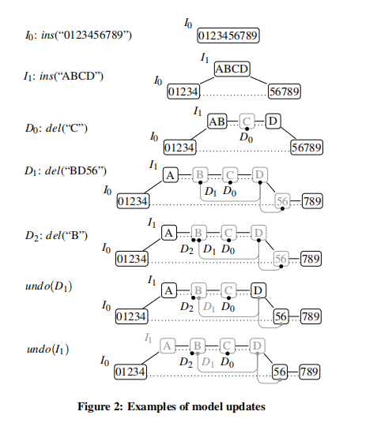
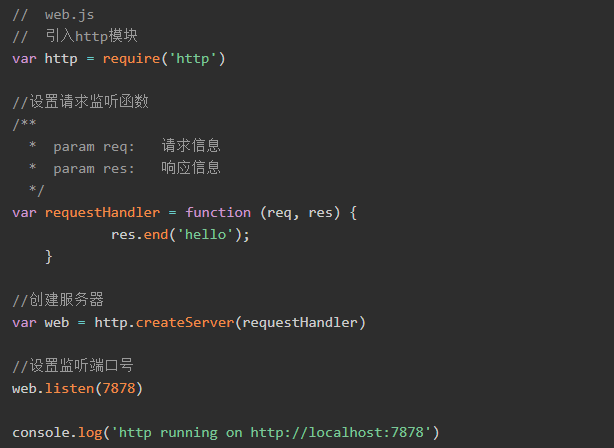
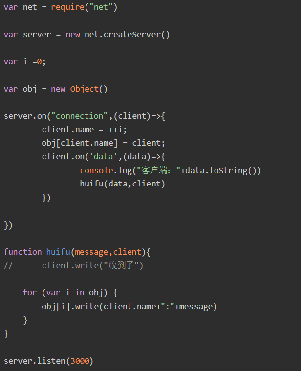

# 可行性报告

**OSLOVE**

[TOC]

## 项目介绍

使用TypeScript实现基于CRDT的LaTeX实时协作编辑系统，编写成符合LSP协议的插件，并使之能在vscode等IDE上使用。

## 理论依据

### CRDT

#### 概览

每个客户端有一个view，一个model，一个日志和3个队列，其中view就是当前的字符串，一个用户可以在该字符串的任意位置插入或删除一个子串，以及撤销日志中的任意一个本地或远程的历史操作。本地的操作和来自其他用户的操作首先保存在队列Q_v和Q_in中，再通过model进行整合，整合后的本地操作首先存在队列Q_out中，之后广播给其他客户端。当model渲染完毕，本地和远程操作的整合将会展示在view中，同时保存在日志里。


所谓的model实际上是双向链表和邻接表。双向链表用来保存每一次操作的子串以及额外的标识信息，它们以一定的顺序相连。每一种操作占一张邻接表，用来保存每次这种操作所涉及的所有结点。下图便是一个例子，用黑色实线表示实际字符串的相邻，虚线表示同一次插入操作插入的结点，灰色实线表示同一次删除操作删除的结点，结点下面的黑点是结点被删除的标记，而灰点表示此次删除被撤销了，当遇到插入或删除操作时，先分裂结点，再修改标记和邻接表。注意到，撤销D1操作不会将B还原，因为B被并发地删除了两次(D1,D2)。



#### 数据结构

##### 基本概念

- pid​：每个用户有一个唯一的pid来标识其身份。
- pun​：一个确定的用户每进行一次操作pun递增1，(pid,pun)唯一确定了一次操作。
- 位置：一个字符串的字符之间的空位，最左边字符的左边为第0个位置，最右边字符的右边为最后一个位置。
- str[pos]​：位置pos右边的字符。
- pos[c]​：字符c左边的位置。

##### 结点

model链表的结点，同属于一次插入操作生成的结点叫做同类结点，此插入操作叫做它们的对应插入操作，一个结点有用于交互部分和本地的属性，其中用于交互的属性如下：

- (pid,pun)​：所对应插入操作的pid和pun。
- str​：结点的内容
- offset​：str的最左边的位置与它对应插入操作的作用位置的差，如一个结点由插入操作生成，则它的offset=0；从它的pos位置分裂成两个结点，左边的结点的offset=0，右边的结点的offset=pos。每一个结点都可以被​(pid,pun,offset)​唯一地确定。
- l,r​：指向结点实际的左边和右边的指针，相当于上图的黑色实线。
- i_l,i_r​：指向结点在它对应插入操作里的相邻结点的指针，相当于上图中的虚线。
- dep_l,dep_r：用于描述结点在原始插入链表（由黑色实线相连）中的位置，分别是它左侧结点的最右端位置(pid,pun,offset,len)和它右侧结点的最左端位置(pid,pun,offset)。
- dels​：与这个结点有关的删除元素们。
- undo​：与这个结点有关的撤销元素。
- visible​：结点是否可见。

注意到，由不同用户发出的对同一结点的删除操作，通常是因为他们的不同删除区域之间有重叠，应该视为不同的删除操作（需要撤销两次），所以一个结点要维护多个删除元素；但是由不同用户对同一结点的撤销操作一般是两个完全相同的操作，所以一个结点只用维护一个撤销元素。

本地的属性如下：

peerpos​：结点的编号。在渲染之前，不同的本地用户可能有完全不同的结点编号。当一个结点被插入到两个相邻编号的结点中间时，要调整相邻结点的编号使得满足结点编号严格单增。

- strInView​：结点所含的字符串是否被展示在​view​上。

一个结点v​渲染完毕时，v.visible=v.strInView​。

##### 删除元素

- (pid,pun)​：所对应删除操作的pid和pun。
- v​：包含此删除元素的结点。
- l,r​：指向所对应删除操作中，此删除元素的相邻删除元素的指针。
- undo​：该删除元素对应的撤销元素。

##### 撤销元素

- (pid,pun)​：所对应撤销操作的pid和pun。
- do：该撤销元素所对应的原操作，可能是结点，删除元素以及其他撤销操作。
- undo​：该撤销元素对应的撤销元素，如果一个撤销操作自身被撤销了（重做），这个撤销操作的​undo​元素将指向另一个撤销操作，从而形成一个撤销链表。
- ties​：和该撤销元素撤销同一个操作的其他撤销元素。

一个操作被有效地撤销当且仅当它被撤销奇数次，即它对应结点的撤销链表长度为奇数。

一个结点可见当且仅当它没被有效地撤销，且它的删除元素们全被有效地撤销。

##### 日志

保存了可以被撤销的操作元素，对于插入操作可以只保存链表的最左侧结点。

#### 操作和广播

用户对view的字符串进行的原始操作可以概括为以下三类：

- ins(pos,str)​：在pos位置插入字符串str。
- del(pos,len)：删除pos位置右边的len个字符。
- undo(pid,pun)：撤销(pid,pun)的操作，可以为ins,del或undo。

连续的字符操作会被合并为一个字符串操作，这些操作会进入该用户的Qv队列，以待变换成以下的原子操作：

- move(x)：将当前的光标移动x的距离。
- ins(str)：在当前光标处插入字符串str。
- del(len)：删除当前光标右边的len个字符。
- undo(pid,pun)：同上。

本地操作结束后，将Qv队列中的所有操作变换成原子操作整合到model中（即按一定的规则添加、删除、分裂结点或修改原有结点的属性），并加入到日志里，同时让Qv中每个操作的一些属性进入Qout队列，以待广播给别的用户。然后从Qin队列中取出其他用户广播来的操作，再将它们整合到model中。当所有的操作被整合后，将model渲染到view上。


需要广播给其他用户的内容(update)：

- ins：(pid,pun)，str，depl，depr。
- del：(pid,pun)。注意到，只有删除区域两端的结点有可能因为删除操作要分裂，所以还要广播它们的信息以确定删除区域：删除区域两端结点的(v.pid,v.pun,offset_old,v.offset_new,v.len)，在另外一个用户端通过offset_old确定被分裂结点的位置，再从offset_new处分裂。
- undo：(pid,pun)，被撤销操作的(pid,pun)。

注意，撤销操作必须有最高的优先级，撤销操作发出后，应该立刻进入队列并整合到model中，同时向其他用户广播这一撤销。

#### 整合

##### 本地操作

ins：如果插入位置在一个可见结点的中间，则先将这个结点分裂成两个结点，再把新的结点插入到它们之间；如果插入位置在两个可见结点之间，要把它插入到这两个可见结点之间的所有不可见结点左边。对于分裂的结点，要保证属性和原来的一致。

del：把删除元素作用且当前view中可见的结点的dels设置成对应的del元素，如果删除范围的左右边界在结点中间，就将该结点分裂。

undo：把相应的元素的undo设为该undo操作，该操作涉及的结点设为不渲染，同时改变渲染范围。

##### 远程操作

一个远程操作在被整合到model之前，必须确保与它相关的结点和元素都是在本地可访问的，否则这个操作只能停留在Qin队列里。

**远程插入操作的冲突处理是此算法的核心。**


以上图为例，当Peer3发出的操作：在a和h之间插入x时，由于其他3个Peer之前的操作，我们必须设计一个合理算法，使得x的插入位置在所有用户本地的model中是一样的。首先我们定义对于在任意区间(v1,v2)之间的结点，如果它在本地插入的时候(v1,v2)内还有别的结点（不含端点），则这样的结点是不会和之后插入的结点冲突的。注意到，将x插入到(a,h)之间时，只有f会和它冲突（因为其他的结点都在(a,h)区间内有相邻的结点），所以我们先解决x与f的冲突。这里可以假定pid大的插入放在右边，由于Peer4插入了f，所以x只能插入到(a,f)区间。在(a,f)区间内有bb，c，d三个与插入x冲突的结点，经过比较pid知f应该插入到c和d之间，而c和d中没有结点，所以f可以插入，插入操作结束。在[1]中证明了这种算法一定能在所有用户端确定存在、相同且唯一的插入位置。


在具体实现中，我们可以利用上文所述的结点的dep属性。如果一个结点在本地插入时的两端恰为它所在区间端点的位置，说明该区间一定只有它一个结点，即该结点与要插入的结点冲突。

远程删除和撤销只需要把广播的信息翻译成本地的删除和撤销操作即可。对于删除操作，利用广播来的offset很容易找到要删除的结点；对于撤销操作，如果该撤销的结点已经被撤销了，只需要把此撤销元素加入该结点的撤销链表即可。还要注意并发的删除操作有累积效应，而并发的撤销操作只进行一次。

#### 渲染

维护一个(renderl,renderr)表示当前需要渲染的区域，每当所有操作整合完毕时，用一个curr指针遍历(renderl,renderr)内的所有结点。由数据结构中的定义，仅当v.visible!=v.strInView时，该结点需要渲染。


### Language-Server-Protocol

wait for lym

## 技术依据

### vscode插件开发

参考vscode官方文档Your First Extension(Example - Hello World)，我们开发自己的插件的步骤非常简单，首先打开cmd输入以下命令

```
npm install -g yo generator-code
```

```
yo code
```

来生成编写插件所需的基本代码并进行一些配置


选择Typescript最后会有两个主要的文件extension.ts和package.json我们可以手动在这两个文件增添配置来实现新的功能，例如我们要在vscode窗口输出hello world


在extension.ts和package.json中添加事件即可。我们用typescript编写自己的插件时，将各部分的功能代码import进入即可。

最后是vscode插件的发布，vscode插件的发布需要使用vsc发布，首先注册一个Azure DevOps账号再

```
npm install -g vsce
vsce package // 打包插件 .vsix 格式
vsce publish // 发布到 MarketPlace
```

就可以在vscode extention商店中找到我们自己编写的插件

### node搭建服务器

Node.js 是一个基于 Chrome V8 引擎的 JavaScript运行环境。 Node.js 使用了一个事件驱动、非阻塞式 I/O 的模型。

Node 是一个让 JavaScript 运行在服务端的开发平台，它让 JavaScript 成为与PHP、Python、Perl、Ruby 等服务端语言平起平坐的脚本语言。  发布于2009年5月，由Ryan Dahl开发，实质是对Chrome V8引擎进行了封装。

Node对一些特殊用例进行优化，提供替代API，使得V8在非浏览器环境下运行得更好。V8引擎执行Javascript的速度非常快，性能非常好。Node是一个基于Chrome JavaScript运行时建立的平台， 用于方便地搭建响应速度快、易于扩展的网络应用。Node 使用事件驱动， 非阻塞I/O 模型而得以轻量和高效，非常适合在分布式设备上运行数据密集型的实时应用。

nodejs的功能十分强大，用nodejs搭建服务器非常方便，我们可以用nodejs中的express模块或者http模块或者net模块搭建一个简单实用的服务器。

例如使用http模块搭建web服务器框架只用以下代码即可



使用net模块搭建服务器框架




* socket.io实现服务器与客户端的通信


Socket.io将Websocket和轮询（Polling）机制以及其它的实时通信方式封装成了通用的接口，并且在服务端实现了这些实时机制的相应代码。socket.io的最大特点就是封装websocket等协议实现了tcp客户端和服务器的全双工通信。

虽然socket.io是javascript库，但在typescript中导入socket.io仅需一段代码

`import * as socket from 'socket.io';`

基于socket.io在客户端中用简单的几条命令就能实现与服务器的事件的发送与监听


常用API解析，客户端和服务端的程序都通用：

1. socket.Server.on('connecntion',func(socket))：监听来自客户端的连接事件并创建socket.Socket对象到回调函数
2. socket.Socket.on('< event >',func(para))：监听来自建立了socket连接的特定socket发出的事件并处理其消息
   socket.Socket.emit('< event >',msg)：发出某事件的消息给socket连接的另一头
3. socket.io(url)：创建一个socket客户端，并连接远程服务端，返回一个socket.Socket对象
4. socket.Server.emit('< event >',msg)：广播消息给所有跟服务端连接的客户端
5. socket.Socket.broadcast.emit('< event >',msg)：某客户端与服务端的socket连接给其它所有的socket广播消息

### latex实时预览

##### 实现思路

本项目将参考Visual Studio Code编辑器上的LaTeX Workshop插件，以及Sublime编辑器上的LaTeXing插件。

##### LaTeX Workshop

###### 简介

LaTeX Workshop是Visual Studio Code的扩展，旨在为使用Visual Studio Code进行LaTeX排版提供核心功能。 它还具有一个同级扩展LaTeX Utilities，提供了额外的功能。其通过预览，编译，自动完成，着色等功能提高LaTeX排版效率。

###### 功能

- 在保存时自动将LaTex(包括Bibex)转化为PDF

- 即时查看PDF（在VS Code或浏览器中）

  

- 正向和反向同步。 单击以在.tex源与PDF中的位置之间跳转

  

- 自动补全

  

- LaTeX日志解析器，在LaTeX构建中的错误和警告，会在VS Code中自动报告

- 快速纠错

- 格式化转换

- 扩展程序还提供了一些快捷方式，使您可以轻松设置文本格式

- 悬停预览。 将鼠标悬停在数学环境的开始标记上会弹出mathjax预览

授权条款类型：The MIT License

###### 源码目录以及部分解析

- data	

  基本数据的JSON，如数学符号、基本操作、代码块							

- icons

  插件图标

- node_modules

  语法支持模块

- out

  Visual Studio Code用户界面交互

- resources

  格式化转换的JS以及JSON

- snippets

  自动补齐的JSON文件

- syntax

  语法结构，包括C语言语法

- viewer

  修改过的火狐内置PDF阅读器

## 技术路线

本项目实现分为两部分：

### 编辑器插件

编辑器插件基于 CRDT（Conflict-free Replicated Data Type）技术，以字符串为原子结构的实时⽂本协作系统。将主要由Typescript编写而成，符合LSP(Language Server Protocol)规则。

### 语法支持插件

参考现有插件(LaTeX Workshop)并对其修改，使其符合LSP规则。

## 参考文献

[1]Yu, W. (2014). Supporting String-Wise Operations and Selective Undo 
for Peer-to-Peer Group Editing. Proceedings of the 18th International 
Conference on Supporting Group Work - GROUP  ’14. doi:10.1145/2660398.2660401 

[2]https://go.microsoft.com/fwlink/?LinkId=733558

[3]http://www.latex-project.org/

[4]https://github.com/James-Yu/LaTeX-Workshop

[5]https://socket.io/docs/

[6]https://code.visualstudio.com/api

[7]https://www.jianshu.com/p/c5fcef31707d

