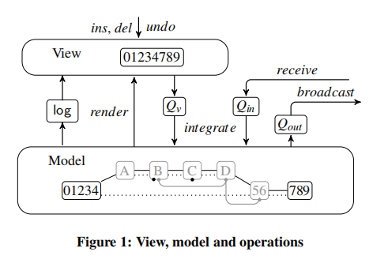

# <span id="head1"> 可行性报告</span>

**OSLOVE**

[ 可行性报告](#head1)

- [ 项目介绍](#head2)
- [ 理论依据](#head3)
  - [ CRDT](#head4)
    - [ 概览](#head5)
    - [ 数据结构](#head6)
    - [ 操作和广播](#head7)
    - [ 整合](#head8)
      - [ 本地操作](#head9)
      - [ 远程操作](#head10)
    - [ 渲染](#head11)
  - [ Language-Server-Protocol](#head12)
    - [ 基本协议](#head13)
    - [ 标题部分](#head14)
    - [ 内容部分](#head15)
    - [ 请求信息](#head16)
    - [ 回应信息](#head17)
- [ 技术依据](#head18)
  - [ vscode插件开发](#head19)
  - [ flask搭建服务器](#head20)
  - [ socket.io实现服务器与客户端的通信](#head21)
    - [ 客户端](#head22)
    - [ 服务器](#head23)
  - [ latex实时预览](#head24)
    - [ 实现思路](#head25)
    - [LaTeX Workshop](#head26)
      - [ 简介](#head27)
      - [ 功能](#head28)
- [ 技术路线](#head29)
- [ 参考文献](#head30)

## <span id="head2"> 项目介绍</span>

使用TypeScript实现基于CRDT的LaTeX实时协作编辑系统，编写成符合LSP协议的插件，并使之能在vscode等IDE上使用。

## <span id="head3"> 理论依据</span>

### <span id="head4"> CRDT</span>

#### <span id="head5"> 概览</span>

每个客户端有一个view，一个model，一个日志和3个队列，其中view就是当前的字符串，一个用户可以在该字符串的任意位置插入或删除一个子串，以及撤销日志中的任意一个本地或远程的历史操作。本地的操作和来自其他用户的操作首先保存在队列Q_v和Q_in中，再通过model进行整合，整合后的本地操作首先存在队列Q_out中，之后广播给其他客户端。当model渲染完毕，本地和远程操作的整合将会展示在view中，同时保存在日志里。



#### <span id="head6"> 数据结构</span>

**基本概念：**

- pid​：每个用户有一个唯一的pid来标识其身份。
- pun​：一个确定的用户每进行一次操作pun递增1，(pid,pun)唯一确定了一次操作。
- 位置：一个字符串的字符之间的空位，最左边字符的左边为第0个位置，最右边字符的右边为最后一个位置。
- str[pos]​：位置pos右边的字符。
- pos[c]​：字符c左边的位置。

**结点：**

model链表的结点，同属于一次插入操作生成的结点叫做同类结点，此插入操作叫做它们的对应插入操作，一个结点有用于交互部分和本地的属性，其中用于交互的属性如下：

- (pid,pun)​：所对应插入操作的pid和pun。
- str​：结点对应的字符串。
- offset​：str的最左边的位置与它对应插入操作的作用位置的差，如一个结点由插入操作生成，则它的offset=0；从它的pos位置分裂成两个结点，左边的结点的offset=0，右边的结点的offset=pos。每一个结点都可以被​(pid,pun,offset)​唯一地确定。
- dep_l,dep_r：用于描述结点对应的插入操作在原始链表中的位置。分别为该插入操作左侧和右侧的结点。
- dels​：与这个结点有关的删除元素们。
- undo​：与这个结点有关的撤销元素。
- visible​：结点是否可见。

注意到，由不同用户发出的对同一结点的删除操作，通常是因为他们的不同删除区域之间有重叠，应该视为不同的删除操作（需要撤销两次），所以一个结点要维护多个删除元素；但是由不同用户对同一结点的撤销操作一般是两个完全相同的操作，所以一个结点只用维护一个撤销元素。

本地的属性如下：

- peerpos​：结点的编号，用以确定结点在本地端的相对位置。当一个结点被插入到两个peerpos相邻的结点之间时，需要修改它们的peerpos以保证所有结点的peerpos严格递增。

- strInView​：结点所含的字符串是否被展示在​view​上。

当v.visible!=v.strInView​时，说明这个结点在view中和在model中的可见状态不一样，此时需要在view中渲染这一结点，即按照规则改变它的可见状态。

**删除元素：**

- (pid,pun)​：所对应删除操作的pid和pun。
- v​：包含此删除元素的结点。
- l,r​：指向所对应删除操作中，此删除元素的相邻删除元素的指针。
- undo​：该删除元素对应的撤销元素。

**撤销元素：**

- (pid,pun)​：所对应撤销操作的pid和pun。
- do：该撤销元素所对应的原操作，可能是结点，删除元素以及其他撤销操作。
- undo​：该撤销元素对应的撤销元素，如果一个撤销操作自身被撤销了（重做），这个撤销操作的​undo​元素将指向另一个撤销操作，从而形成一个撤销链表。
- ties​：和该撤销元素撤销同一个操作的其他撤销元素。

**可见(visible)判据：**

一个操作被有效地撤销当且仅当它被撤销奇数次，即它对应结点的撤销链表长度为奇数。

一个结点的visible=true当且仅当它没被有效地撤销，且它的删除元素们全被有效地撤销。

**日志**

保存了可以被撤销的操作元素，对于插入操作可以只保存链表的最左侧结点。

#### <span id="head7"> 操作和广播</span>

用户对view的字符串进行的原始操作可以概括为以下三类：

- ins(pos,str)​：在pos位置插入字符串str。
- del(pos,len)：删除pos位置右边的len个字符。
- undo(pid,pun)：撤销(pid,pun)的操作，可以为ins,del或undo。

连续的字符操作会被合并为一个字符串操作，这些操作会进入该用户的Qv队列，以待变换成以下的原子操作：

- move(x)：将当前的光标移动x的距离。
- ins(str)：在当前光标处插入字符串str。
- del(len)：删除当前光标右边的len个字符。
- undo(pid,pun)：同上。

本地操作结束后，将Qv队列中的所有操作变换成原子操作整合到model中（即按一定的规则添加、删除、分裂结点或修改原有结点的属性），并加入到日志里，同时让Qv中每个操作的一些属性进入Qout队列，以待广播给别的用户。然后从Qin队列中取出其他用户广播来的操作，再将它们整合到model中。当所有的操作被整合后，将model渲染到view上。


注意，撤销操作必须有最高的优先级，撤销操作发出后，应该立刻进入队列并整合到model中，同时向其他用户广播这一撤销。

#### <span id="head8"> 整合</span>

##### <span id="head9"> 本地操作</span>

ins：如果插入位置在一个可见结点的中间，则先将这个结点分裂成两个结点，再把新的结点插入到它们之间；如果插入位置在两个可见结点之间，要把它插入到这两个可见结点之间的所有不可见结点左边。对于分裂的结点，要保证属性和原来的一致。

del：把删除元素作用且当前view中可见的结点的dels设置成对应的del元素，如果删除范围的左右边界在结点中间，就将该结点分裂。

undo：把相应的元素的undo设为该undo操作，修改undo链表。

这些操作进行完后都要根据可见判据修改结点的visible状态以及render区间。

##### <span id="head10"> 远程操作</span>

一个远程操作在被整合到model之前，必须确保与它相关的结点和元素都是在本地可访问的，否则这个操作只能停留在Qin队列里。


以上图为例，当Peer3发出的操作：在a和h之间插入x时，由于其他3个Peer之前的操作，我们必须设计一个合理算法，使得x的插入位置在所有用户本地的model中是一样的。首先我们定义对于在任意区间(v1,v2)之间的结点，如果它在本地插入的时候(v1,v2)内还有别的结点（不含端点），则这样的结点是不会和之后插入的结点冲突的。注意到，将x插入到(a,h)之间时，只有f会和它冲突（因为其他的结点都在(a,h)区间内有相邻的结点），所以我们先解决x与f的冲突。这里可以假定pid大的插入放在右边，由于Peer4插入了f，所以x只能插入到(a,f)区间。在(a,f)区间内有bb，c，d三个与插入x冲突的结点，经过比较pid知f应该插入到c和d之间，而c和d中没有结点，所以f可以插入，插入操作结束。在[1]中证明了这种算法一定能在所有用户端确定存在、相同且唯一的插入位置。


在具体实现中，我们可以利用上文所述的结点的dep属性。如果一个结点在本地插入时的两端恰为它所在区间端点的位置，说明该区间一定只有它一个结点，即该结点与要插入的结点冲突。

远程删除和撤销只需要把广播的信息翻译成本地的删除和撤销操作即可。对于删除操作，利用广播来的offset很容易找到要删除的结点；对于撤销操作，如果该撤销的结点已经被撤销了，只需要把此撤销元素加入该结点的撤销链表即可。还要注意并发的删除操作有累积效应，而并发的撤销操作只进行一次。

#### <span id="head11"> 渲染</span>

维护一个结点的下标区间(render_l,render_r)表示当前需要渲染的区域，当所有操作整合完毕时，用一个curr指针遍历(render_l,render_r)内的所有结点。由数据结构中的定义，仅当v.visible!=v.strInView时，该结点需要渲染。


### <span id="head12"> Language-Server-Protocol</span>

通信路径：vscode插件通过JSON与LSP通信，LSP通过JSON与server通信。

LSP协议定义了一组JSON-RPC请求，响应和通知消息，这些消息使用上述基本协议进行交换。 本节开始描述协议中使用的基本JSON结构。 该文档使用TypeScript接口来描述这些接口。 基于基本的JSON结构，描述了实际请求及其响应和通知。

通常，语言服务器协议支持JSON-RPC消息，但是此处定义的基本协议使用约定，以便传递给请求/通知消息的参数应该是对象类型（如果完全传递的话）。 但是，这不允许在自定义消息中使用数组参数类型。

#### <span id="head13"> 基本协议</span>

基本协议由标题和内容部分（与HTTP相比）组成。 标题和内容部分以“ \ r \ n”分隔。

#### <span id="head14"> 标题部分</span>

标题部分由标题字段组成。 每个标题字段均包含一个名称和一个值，并以“：”（冒号和空格）分隔。 每个标题字段均以“ \ r \ n”结尾。 考虑到最后一个标头字段和整个标题本身都以'\ r \ n'结尾，并且至少有一个标题是强制性的，这意味着两个'\ r \ n'序列始终紧接在消息的内容部分之前 。

当前支持以下标题字段：

| 标题字段名称 | 值类型 | 描述                                                         |
| ------------ | ------ | ------------------------------------------------------------ |
| 内容长度     | 数字   | 内容部分的长度（以字节为单位）。 此标头是必需的。            |
| 内容类型     | 字符串 | 内容部分的媒体类型。 默认为application / vscode-jsonrpc; 字符集= utf-8 |

标题部分使用“ ascii”编码进行编码。 其中包括分隔标题和内容部分的“ \ r \ n”。

#### <span id="head15"> 内容部分</span>

包含消息的实际内容。 消息的内容部分使用JSON-RPC来描述请求、响应和通知。 使用Content-Type字段中提供的字符集对内容部分进行编码。 它默认为utf-8，这是目前唯一支持的编码。 如果服务器或客户端收到的标题与utf-8编码不同，则应以错误响应。

实例：

```
Content-Length: ...\r\n
\r\n
{
	"jsonrpc": "2.0",
	"id": 1,
	"method": "textDocument/didOpen",
	"params": {
		...
	}
}
```

#### <span id="head16"> 请求信息</span>

以下的JSON用来描述客户端和服务器之间请求。每个已处理的请求都必须将响应发送回请求的发送者。

```
interface RequestMessage extends Message {

	/**
	 * The request id.
	 */
	id: number | string;

	/**
	 * The method to be invoked.
	 */
	method: string;

	/**
	 * The method's params.
	 */
	params?: array | object;
}
```

#### <span id="head17"> 回应信息</span>

作为请求结果发送的响应消息。 如果请求未提供结果值，则请求的接收者仍然需要返回响应消息以符合JSON RPC规范。 在这种情况下，应将ResponseMessage的result属性设置为null，以发出成功的请求信号。

```
interface ResponseMessage extends Message {
	/**
	 * The request id.
	 */
	id: number | string | null;

	/**
	 * The result of a request. This member is REQUIRED on success.
	 * This member MUST NOT exist if there was an error invoking the method.
	 */
	result?: string | number | boolean | object | null;

	/**
	 * The error object in case a request fails.
	 */
	error?: ResponseError;
}
```

剩余内容详见本仓库内的LSP技术文档。

## <span id="head18"> 技术依据</span>

### <span id="head19"> vscode插件开发</span>

参考vscode官方文档Your First Extension(Example - Hello World)，我们开发自己的插件的步骤非常简单，首先打开cmd输入以下命令

```
npm install -g yo generator-code
```

```
yo code
```

来生成编写插件所需的基本代码并进行一些配置


选择Typescript最后会有两个主要的文件extension.ts和package.json，我们可以手动在这两个文件增添配置来实现新的功能，例如我们要在vscode窗口输出hello world：


在extension.ts和package.json中添加事件即可。我们用typescript编写自己的插件时，将各部分的功能代码import进入即可。

最后是vscode插件的发布，vscode插件的发布需要使用vsc发布，首先注册一个Azure DevOps账号再

```
npm install -g vsce
vsce package // 打包插件 .vsix 格式
vsce publish // 发布到 MarketPlace
```

就可以在vscode extention商店中找到我们自己编写的插件

### <span id="head20"> flask搭建服务器</span>

经过讨论，我们改为使用flask搭建服务器，代码位于https://github.com/OSH-2020/colive-server

Flask是一个轻量级的可定制框架，使用Python语言编写，较其他同类型框架更为灵活、轻便、安全且容易上手。它可以很好地结合MVC模式进行开发，开发人员分工合作，小型团队在短时间内就可以完成功能丰富的中小型网站或Web服务的实现。另外，Flask还有很强的定制性，用户可以根据自己的需求来添加相应的功能，在保持核心功能简单的同时实现功能的丰富与扩展，其强大的插件库可以让用户实现个性化的网站定制，开发出功能强大的网站。

为什么服务器不用node？

python 的好处在于成熟，flask  老框架了，而且简单而容易开发，依赖管理轻松，
要用 nodejs 那就要：
首先考虑要不要 webpack（可以不要），
再考虑要不要 babel（没有的话 commonjs 的 lint 问题挺多的，还有 node 的一些其他语法），
要考虑要不要 ts（没有类型检查容易出错），顺带配置 tsconfig，
且一套下来后用 babel 编译 tsc 速度慢，本地 node 版本还要考虑兼容性问题。

### <span id="head21"> socket.io实现服务器与客户端的通信</span>

#### <span id="head22"> 客户端</span>

Socket.io将Websocket和轮询（Polling）机制以及其它的实时通信方式封装成了通用的接口，并且在服务端实现了这些实时机制的相应代码。socket.io的最大特点就是封装websocket等协议实现了tcp客户端和服务器的全双工通信。

虽然socket.io是javascript库，但在typescript中导入socket.io仅需一段代码

`import * as socket from 'socket.io';`

基于socket.io在客户端中用简单的几条命令就能实现与服务器的事件的发送与监听


常用API解析，客户端和服务端的程序都通用：

1. socket.Server.on('connecntion',func(socket))：监听来自客户端的连接事件并创建socket.Socket对象到回调函数
2. socket.Socket.on('< event >',func(para))：监听来自建立了socket连接的特定socket发出的事件并处理其消息
socket.Socket.emit('< event >',msg)：发出某事件的消息给socket连接的另一头
3. socket.io(url)：创建一个socket客户端，并连接远程服务端，返回一个socket.Socket对象
4. socket.Server.emit('< event >',msg)：广播消息给所有跟服务端连接的客户端
5. socket.Socket.broadcast.emit('< event >',msg)：某客户端与服务端的socket连接给其它所有的socket广播消息

#### <span id="head23"> 服务器</span>

flask也支持socket.io，以下是一个js客户端和python服务器通信的示例：

```javascript
//client.js
var io = require('socket.io-client');
var socket = io.connect('http://localhost:5000', {reconnect: true});

// Add a connect listener
socket.on('connect',(socket)=>{
console.log('Connected!');
});
socket.on('message',(msg)=>{
console.log(msg);
});
socket.emit('message','This is the message from client.js to server.py');
```

```python
#server.py
from flask import Flask, render_template
from flask_socketio import SocketIO,send
app = Flask(__name__)
app.config['SECRET_KEY'] = 'secret!'
socketio = SocketIO(app)

@socketio.on('message')
def handle_message(message):
print('received message: ' + message)
send('This is the message from server.py to client.js')
if __name__ == '__main__':
socketio.run(app)
```

客户端收到服务器的信息后，向服务器发送信息。


服务器收到客户端的信息：


### <span id="head24"> latex实时预览</span>

#### <span id="head25"> 实现思路</span>

本项目将参考Visual Studio Code编辑器上的LaTeX Workshop插件，以及Sublime编辑器上的LaTeXing插件。

#### <span id="head26">LaTeX Workshop</span>

##### <span id="head27"> 简介</span>

LaTeX Workshop是Visual Studio Code的扩展，旨在为使用Visual Studio Code进行LaTeX排版提供核心功能。 它还具有一个同级扩展LaTeX Utilities，提供了额外的功能。其通过预览，编译，自动完成，着色等功能提高LaTeX排版效率。

##### <span id="head28"> 功能</span>

- 在保存时自动将LaTex(包括Bibex)转化为PDF

- 即时查看PDF（在VS Code或浏览器中）


- 正向和反向同步。 单击以在.tex源与PDF中的位置之间跳转


- 自动补全


- LaTeX日志解析器，在LaTeX构建中的错误和警告，会在VS Code中自动报告

- 快速纠错

- 格式化转换

- 扩展程序还提供了一些快捷方式，使您可以轻松设置文本格式

- 悬停预览。 将鼠标悬停在数学环境的开始标记上会弹出mathjax预览

授权条款类型：The MIT License

## <span id="head29"> 技术路线</span>

本项目实现分为三部分：

- 编写本地端vscode多人协作插件，由吴钰同和黄炜喆负责。
- 搭建服务器并实现与多个客户端之间的通信，从而完成多人协作编辑的演示，由明宇龙负责。
- 处理vscode插件和lsp之间的通信，以及lsp与服务器之间的通信，由李钰铭和黄炜喆负责。

## <span id="head30"> 参考文献</span>

[1]Yu, W. (2014). Supporting String-Wise Operations and Selective Undo 
for Peer-to-Peer Group Editing. Proceedings of the 18th International 
Conference on Supporting Group Work - GROUP  ’14. doi:10.1145/2660398.2660401 

[2]https://go.microsoft.com/fwlink/?LinkId=733558

[3]http://www.latex-project.org/

[4]https://github.com/James-Yu/LaTeX-Workshop

[5]https://socket.io/docs/

[6]https://code.visualstudio.com/api

[7]https://www.jianshu.com/p/c5fcef31707d

[8]https://dormousehole.readthedocs.io/en/latest/

[9]https://flask-socketio.readthedocs.io/en/latest/

[10]https://www.itranslater.com/qa/details/2325668939650565120