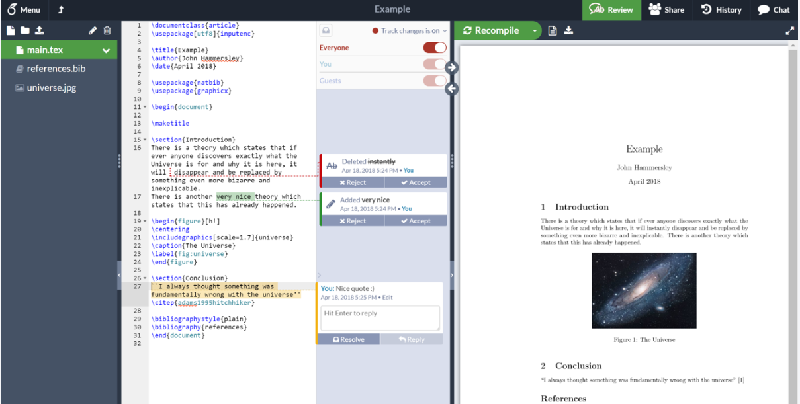
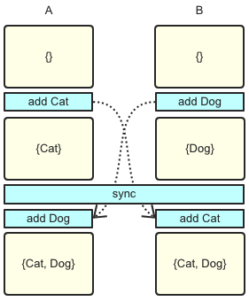
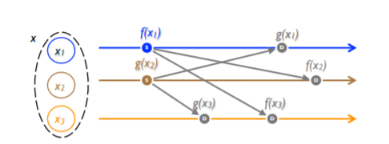

#  调研报告

**OSLOVE**

-  [调研报告](#head1)
  - [ 目录](#head2)
  - [ 小组成员](#head3)
  - [ 项目简介](#head4)
  - [ 项目背景](#head5)
    - [ LaTex](#head6)
      - [ 简介](#head7)
      - [ 设计思路](#head8)
      - [ 特性与功能](#head9)
    - [ 传统的协作策略](#head10)
      - [ 人工管理](#head11)
      - [版本控制：Git 和 SVN](#head12)
    - [ 现有的LaTex实时编辑系统](#head13)
      - [ Overleaf](#head14)
      - [ 其他LaTex实时编辑系统](#head15)
  - [ 立项依据](#head16)
    - [ TypeScript](#head17)
      - [ TypeScript简介](#head18)
      - [ TypeScript与Javascript的对比](#head19)
    - [ Language-Server-Protocol](#head20)
    - [ CRDT](#head21)
      - [ CRDT简介](#head22)
      - [ 参考18年项目的CRDT的不足](#head23)
    - [String-wise CRDT and Selective Undo](#head24)
      - [OT(Operational Transformation)](#head25)
      - [CRDT(Conflict-Free Replicated Data Types)](#head26)
      - [Merging the two Methods](#head27)
  - [ 重要性与前瞻性分析](#head28)
  - [ 相关工作](#head29)
    - [Visual Studio-Live Share](#head30)
    - [ Atom-Teletype](#head31)
  - [ 参考文献](#head32)

##  小组成员

- 吴钰同（PB18111684）
- 黄炜喆（PB18111765）
- 李钰铭（PB18111771）
- 明宇龙（PB18111710）

##  项目简介

使用TypeScript实现基于CRDT的LaTeX实时协作编辑系统，编写成符合LSP协议的插件，并使之能在vscode等IDE上使用。

##  项目背景

###  LaTex

####  简介

**LaTeX**（/ˈlɑːtɛx/，常被读作/ˈlɑːtɛk/或/ˈleɪtɛk/，写作“LATEX”），是一种基于TeX的排版系统，由美国计算机科学家莱斯利·兰伯特在20世纪80年代初期开发，利用这种格式系统的处理，即使用户没有排版和程序设计的知识也可以充分发挥由TeX所提供的强大功能，不必一一亲自去设计或校对，能在几天，甚至几小时内生成很多具有书籍质量的印刷品。

####  设计思路

LaTeX遵循呈现与内容分离的设计理念，以便作者可以专注于他们正在编写的内容，而不必同时注视其外观，将文档排版交由文档设计者实现。在准备LaTeX文档时，作者使用章（chapter）、节（section）、表（table）、图（figure）等简单的概念指定文档的逻辑结构，并让LaTeX系统负责这些结构的格式和布局。因此，它鼓励从内容中分离布局，同时仍然允许在需要时进行手动排版调整。这个概念类似于许多文字处理器允许全局定义整个文档的样式的机制，或使用层叠样式表来规定HTML的样式。LaTeX系统是一种可以处理排版和渲染的标记语言。

####  特性与功能

- 排版期刊文章，技术报告，书籍和幻灯片演示。
- 控制包含节，交叉引用，表格和图形的大型文档。
- 复杂数学公式的排版。
- 使用AMS-LaTeX进行数学的高级排版。
- 自动生成书目和索引。
- 支持多语言排版。
- 包含艺术品，以及印刷或专色。
- 使用PostScript或Metafont字体。
- 各种各样的宏包，拓展了LaTex的功能
- 模板质量高，管理的格式多

###  传统的协作策略

####  人工管理

在内容较少、协作人数较少、目标较简单的情况下，人工管理不失为一种选择。
通过手动地传递文件，大家可以集中工作的成果。
不过在此流程下，内容的合并取舍、并发工作、权限管理等难以实现，效率亦极低，无法满足进一步的需求。
这种形式在工程中被迅速淘汰，几乎不会在项目生产时选用。

#### 版本控制：Git 和 SVN

版本控制利用了一系列的软硬件，将协作的过程提取出来，用一套标准的流程约束，从而满足了多人协作的需求，也方便了自动化。
主流的版本控制分为集中式和分布式，分别以 SVM 和 Git 作为代表。

集中式和分布式最大的区别在于对于内容的储存位置选择。
在集中式下，内容被存放在同一设备上，多人同时连接到这一设备进行工作，有软件完成对于冲突等的处理。
而分布式下，每一节点都拥有完整的一份内容，不同节点间以特定方式完成工作的合并同步等，在发布时则选取某一节点内容作为成品。

无论是分布式还是集中式，都能满足多人协作的需求。就工程上而言，Git 这样的分布式实现作为主流，被广泛使用。
但在版本控制下，由于强调对于内容的管理与处理，对于内容的展现有欠缺之处，实时性不佳，需要额外的工具辅助完成展示。

###  现有的LaTex实时编辑系统

####  Overleaf

Overleaf是一个在线多人实时协作LaTex编辑平台，支持在线创建和管理LaTex项目以及实时预览，同时可以导出源代码或PDF文档。

它的优点：

- 不用安装和配置，打开网站即可编辑。
- 预设了各种package，不用在本地安装。
- 多人协作。
- 版本控制。
- 自动补全。

它的缺点：

- 实时预览速度较慢。
- 免费账户只能支持两个人的协作，即使是付费账户，最多也只能支持10个人的协作。

####  其他LaTex实时编辑系统

- Authorea
- Auto-Latex Equations for Google Docs
- PaperHive

##  立项依据

###  TypeScript

####  TypeScript简介

TypeScript 是 Microsoft 开发和维护的一种面向对象的编程语言。它是 JavaScript 的超集，包含了 JavaScript 的所有元素，可以载入 JavaScript 代码运行，并扩展了 JavaScript 的语法，所以任何现有的JavaScript程序可以运行在在TypeScript环境中，TypeScript会编译为JavaScript，而且本质上向这个语言添加了可选的静态类型和基于类的面向对象编程TypeScript 支持为已存在的 JavaScript 库添加类型信息的头文件，扩展了它对于流行的库如jQuery，Node.js和 D3.js 的好处。

####  TypeScript与Javascript的对比

TypeScript是静态类型，js是动态类型。静态类型检查可以做到early fail，即你编写的代码即使没有被执行到，一旦你编写代码时发生类型不匹配，语言在编译阶段（解释执行也一样，可以在运行前）即可发现，同时IDE也能提供大量便捷支持。对小型项目而言也许发挥不出多大优势，然而当项目规模膨胀，运行前的类型检查就大放异彩了——首先，大型项目测试调试分支覆盖困难，很多代码并不一定能够在所有条件下执行到，运行前的类型检查是减少bug的一大手段；其次，静态类型对阅读代码是友好的，在团队合作、代码维护和交接中意义不言自明；最后，IDE提供的大量便捷支持和TS本身的语法检查和代码提示自动补全让开发者提高效率，方便重构。当然，TypeScript 只是为 JavaScript 中本身就存在的使用方式提供了对应的类型标注，所有在 TypeScript 中能够使用的开发模式，在 JavaScript 中一定是本身就存在的。

TypeScript 可以使用 JavaScript 中的所有代码和编码概念，TypeScript 是为了使 JavaScript 的开发变得更加容易而创建的。例如，TypeScript 使用类型和接口等概念来描述正在使用的数据，这使开发人员能够快速检测错误并调试应用程序，TypeScript 从核心语言方面和类概念的模塑方面对 JavaScript 对象模型进行扩展。JavaScript 代码可以在无需任何修改的情况下与 TypeScript 一同工作，同时可以使用编译器将 TypeScript 代码转换为 JavaScript。

下面列举 TypeScript 相比于 JavaScript 的显著优势：

- 静态输入

静态类型化是一种功能，可以在开发人员编写脚本时检测错误。查找并修复错误是当今开发团队的迫切需求。有了这项功能，就会允许开发人员编写更健壮的代码并对其进行维护，以便使得代码质量更好、更清晰。

- 大型的开发项目

有时为了改进开发项目，需要对代码库进行小的增量更改。这些小小的变化可能会产生严重的、意想不到的后果，因此有必要撤销这些变化。使用TypeScript工具来进行重构更变的容易、快捷。

- 更好的协作

当发开大型项目时，会有许多开发人员，此时乱码和错误的机也会增加。类型安全是一种在编码期间检测错误的功能，而不是在编译项目时检测错误。这为开发团队创建了一个更高效的编码和调试过程。

- 更强的生产力

干净的 ECMAScript 6 代码，自动完成和动态输入等因素有助于提高开发人员的工作效率。这些功能也有助于编译器创建优化的代码。

###  Language-Server-Protocol

LSP 全称是 Language Server Protocol，是指开放的、基于 JSON 及 RPC 的协议方案。
它实现了 Editor/IDE 与 server 的对于编程语言信息的通信，使得编程语言的支持能够独立于 Editor/IDE 这样的前端，方便 Lint 等的开发与兼容。

LSP 是一种 C/S 架构下的方案，由 Editor/IDE 作为 client，server 则负责对于 client 发来的信息做处理，并提供反馈。
例如在用户编辑时，client 会提供用户目前的状态，例如：打开哪个文件，正在哪个位置插入什么字符，以及必要的 context。
server 在分析后，回复 client 应该进行什么处理。
这里 client 的 request 和 server 的 response 往往是通过 HTTP API 这样不依赖于某一编程语言的实现来完成的。

由于独立了前端，在 Editor/IDE 中添加语言支持时便不需要考虑不同软件下风格迥异的实现，而可以集中精力解决编程语言的分析处理问题。
针对不同的 Editor/IDE，只需提供一个与 Language server 相对接的扩展，解析结果并在软件中实现相应的动作，即可使用同一 Language server 从而实现编程语言的支持。

LSP 在工程实践中被广泛利用，例如 neovim、rls（Rust language server）就是成功的例子。
在 Visual Studio Code 的文档中，对于适配 LSP 的开发也有专门的介绍与描述。

###  CRDT

####  CRDT简介

**CRDT是Conflict-Free Replicated Data Types的缩写**，直译的话即“无冲突可复制数据类型”。研究分布式系统，尤其是研究最终一致性分布式系统的过程中，一个最基本的问题就是，应该采用什么样的数据结构来保证最终一致性。CRDT即是理论界目前对于这个问题的答案。CRDT是各种基础数据结构最终一致算法的理论总结，能根据一定的规则自动合并，解决冲突，达到强最终一致的效果。CAP定理告诉我们，在构建分布式系统的时候，Consistency（一致性），Availability（可用性），Partition tolerance（分区容错性），这三者只可以同时选择两样。最终一致性的系统不是不保证一致性，而是不在保证可用性和分区容错性的同时保证一致性。最终我们还是要在最终一致性的各节点之间处理数据，使他们达到一致。

先简单统一一下概念和名词:

- object: 可以理解为“副本”
- operation: 操作接口，由客户端调用，分为两种，读操作query和写操作update
- query: 查询操作，仅查询本地副本
- update: 更新操作，先尝试进行本地副本更新，若更新成功则将本地更新同步至远端副本
- merge: update在远端副本的合并操作

一个数据结构符合CRDT的条件是update操作和merge操作需满足交换律、结合律和幂等律，具体证明见[3]，在此不做赘述。如果update操作本身满足以上三律，merge操作仅需要对update操作进行回放即可，这种形式称为**op-based CRDT**，最简单的例子是集合求并集。

如果update操作无法满足条件，则可以考虑同步副本数据，同时附带额外元信息，通过元信息让update和merge操作具备以上三律，这种形式称为**state-based CRDT**。让元信息满足条件的方式是让其更新保持“单调”，这个关系一般被称为“偏序关系”。举一个简单例子，每次update操作都带上时间戳，在merge时对本地副本时间戳及同步副本时间戳进行比对，取更新的结果，这样总能保证结果最新并且最终一致，这种方式称为Last Write Wins。

####  参考18年项目的CRDT的不足

1.仅实现了对单个字符的操作，效率很低，而且当面对大量用户编辑或者文档量很大时每个字符的标识符可能会非常长，这样会对内存和运行效率带来很大的影响。

2.为了保证每个客户端不会生成一个已经被使用的位置标识符，需要客户端维持记录保证不会产生使用过的标识符，当编辑时间较长文档量较大时对客户端内存也将带来较大负担。

3.在本地进行编辑时，进行复制删除等操作时有时会出错，对一些细节上的处理存在逻辑漏洞，导致不太好的用户体验。

### String-wise CRDT and Selective Undo

一个实时文本协作系统应该至少支持普通文本编辑器的最基本的功能，包括：**对单个字符的插入和删除**，**对字符串的插入和删除**，以及**对插入和删除的撤销和重做**。其中，基于字符串的操作是许多其他操作的基础，如复制粘贴，选择删除和查找替换；撤销操作的实现很复杂，因为一个客户端不止可以撤销自己的操作，也可以撤销其他客户端的操作。较早的实时文本协作算法不能很好地支持基于字符串的操作，它们的不足如下：

#### OT(Operational Transformation)

为了解决多个客户端同时发出请求产生的冲突，服务器保存所有操作的历史，并把客户端的操作按照一定的规则排序，将排序靠后的操作进行变换使之相容，然后按照此顺序对文本进行更改。

例如：对于s=”abc“这样的字符串，一个用户s[1]='b'之前插入’d‘，此操作记作ins(1,'a')，另一个用户并发地删除s[2]='c'，此操作记作del(2)。OT算法必须能够将del(2)变换成del(3)，以确保删除的是正确的字符。

由于OT算法固有的复杂性，目前很少有OT算法支持基于字符串的操作，例如：两个客户端同时对字符串的同一位置进行粘贴和删除，会使变换算法变得非常复杂，而且容易被举出反例。

#### CRDT(Conflict-Free Replicated Data Types)

CRDT通过数据结构的序关系而非操作变换来处理并发请求，避开了复杂的变换算法。可以通俗地理解为，CRDT为每个字符设计了一个唯一且不变的标识符（如上文所述，这个标识符可以是时间，也可以是某个字符在文档中的相对位置），通过标识符可以唯一确定客户操作的字符，当遇到上述冲突时，实际删除的字符永远是按照标识符来索引的，不会因为前面的字符的插入而改变。

但是，对于字符串的操作，标识符的设计会变得很复杂，而且由于没有保存操作历史，撤销操作无从实现。

#### Merging the two Methods

于是[5]提出将OT和CRDT两种方法结合，从而实现基于字符串的操作和撤销。他的设计如下：每个客户端有一个view，一个model，一个日志和3个队列，其中view就是当前的字符串，一个用户可以在该字符串的任意位置插入或删除一个子串，以及撤销日志中的任意一个本地或远程的历史操作。本地的操作和来自其他用户的操作首先保存在队列Qv和Qin中，再通过model进行整合，整合后的本地操作首先存在队列Qout中，之后广播给其他客户端。当model渲染完毕，本地和远程操作的整合将会展示在view中，同时保存在日志里。

所谓的model实际上是双向链表和邻接表。双向链表用来保存每一次操作的子串以及额外的标识信息，它们以一定的顺序相连。每一种操作占一张邻接表，用来保存每次这种操作所涉及的所有结点。下图便是一个例子，用黑色实线表示实际字符串的相邻，虚线表示同一次插入操作插入的结点，灰色实线表示同一次删除操作删除的结点，结点下面的黑点是结点被删除的标记，而灰点表示此次删除被撤销了，当遇到插入或删除操作时，先分裂结点，再修改标记和邻接表。注意到，撤销D1操作不会将B还原，因为B被并发地删除了两次(D1,D2)。

##  重要性与前瞻性分析

- **着眼Latex**

LaTeX是当今世界上最流行和使用最为广泛的TeX格式。Latex拥有强大功能，从而使用者可以在短短的时间内生成高质量的文档。对于生成复杂的数学公式，LaTeX表现的更为出色。其在排版界的重要性不言而喻。

- **使用CRDT**

CRDT是各种基础数据结构最终一致算法的理论总结，能根据一定的规则自动合并，解决冲突，达到强最终一致的效果。相较于传统OT算法，CRDT更为稳定，可维护性更强。对比之前同学的工作，本项目以字符串为最小单位的CRDT，对复制、粘贴等操作具有更好的支持。

- **利用LSP**

LSP是一种用于IDE与语言服务器之间的一种协议，支持语言插件在不同IDE上使用。相较于浏览器，本项目更加尊重用户习惯；而对比传统语言插件，由于可跨IDE，本项目实用性更强，推广速度更快。

##  相关工作

### Visual Studio-Live Share

Visual Studio Live Share 是由微软的团队为 Visual Studio Code 这一编辑器开发的文本协作编辑扩展。
利用此扩展，多人可以共同编辑同一文档，而无需克隆 repo 或者安装代码所需的任何依赖。
在编辑时，借助共享发起者的环境，其他接受共享者可以获得同样的 context 从而提高效率和体验，例如代码高亮、语义分析，其他人的编辑选定状态等。

目前 Visual Studio Live Share 由于其便利性以及受 Visual Studio Code 推广的红利影响，使用广泛而广为人所接受。
在 Visual Studio Code 的扩展市场上，此扩展拥有 186 万的安装量，在整个扩展市场中亦属于顶级的产品。

然而 Visual Studio Live Share 在中国国内的使用体验由于网络状况不佳而受较大影响。
Visual Studio Live Share 使用了微软官方在 Azure 上架设的服务器，且其区域位于国外而无针对国内的优化，使得分享难连接、易断开，体验不佳。
在断开时，接受分享的用户无法编辑文档，无法调整文档视角，会使得工作停止。
另外由于要求连接到微软的服务器，对于没有互联网连接的内网用户而言此拓展无法使用。

另一方面，Visual Studio Live Share 使用了微软自行制作 License，并不允许第三方对插件进行随意的扩展。
因此我们无法在之上做进一步的开发。

###  Atom-Teletype

Atom是github专门为程序员推出的一个跨平台文本编辑器。具有简洁和直观的图形用户界面，并有很多有趣的特点：支持JavaScript等网页编程语言。它支持宏，自动完成分屏功能，集成了文件管理器。

Teletype是Atom的一个实时协作编辑插件，它使开发者之间的协作变得容易。为了共享工作区，Teletyle引入了real-time portals的概念，当一个用户打开了一个portal时，他的当前工作区便可以通过邀请链接共享，其他协作者可以加入进行实时编辑。Teletype没有设置中心化的服务器，而是使用WebRTC传输协作者之间的通信。

Teletype软件包由三个组件组成：

- teletype-crdt：teletype的核心算法实现
- teletype-server：便于peer发现的服务端应用程序
- teletype-client：管理与其他客户端交互的库

Atom-Teletype的缺点：Atom启动过慢，而且容易崩溃。Teletype需要安装其他依赖，对于普通用户不友好。

##  参考文献

[1]https://github.com/OSH-2018/X-wyj-1

[2]https://en.wikipedia.org/wiki/Comparison_of_TeX_editors

[3]Marc Shapiro, Nuno Preguiça, Carlos Baquero, Marek Zawirski. Conflict-free Replicated Data Types.[Research Report] RR-7687, INRIA. 2011, pp.18. ffinria-00609399v2f 

[4]Marc Shapiro, Nuno Preguiça, Carlos Baquero, Marek Zawirski. A comprehensive study of Convergent and Commutative Replicated Data Types. [Research Report] RR-7506, Inria – Centre ParisRocquencourt;INRIA. 2011, pp.50. ffinria-00555588f 

[5]Yu, W. (2014). Supporting String-Wise Operations and Selective Undo 
for Peer-to-Peer Group Editing. Proceedings of the 18th International 
Conference on Supporting Group Work - GROUP  ’14. doi:10.1145/2660398.2660401 